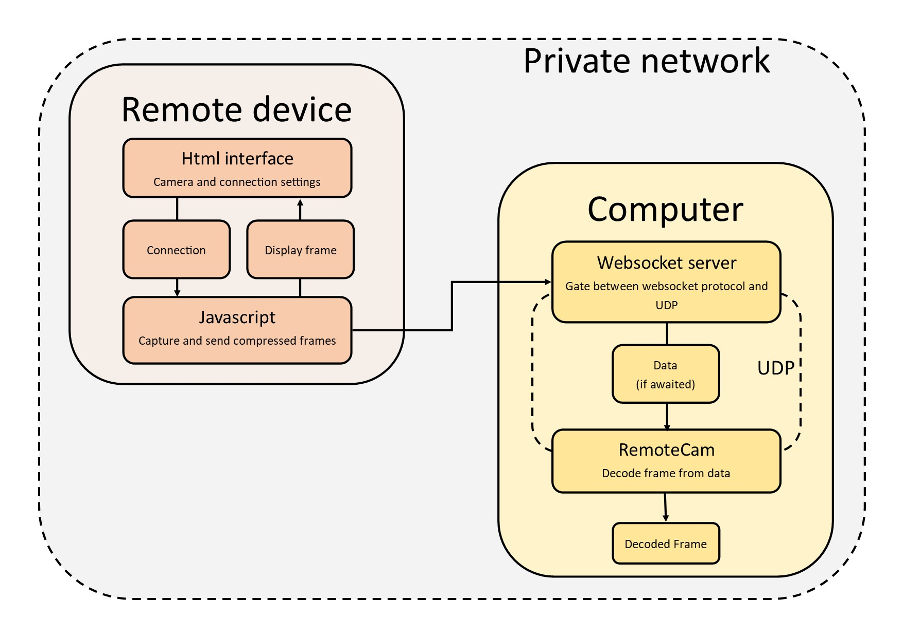
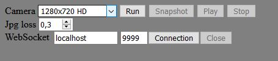

# Package description

RemoteCam is a small package for make video capture in Python from remote device easier.

This package provide :

- python scripts for receiving frames

- html/css and javascript files for remote devices

Requirements :

- Python 3

- Private network

- A device (smartphone, tablet or even another computer) which is able to run web-browsers such as Firefox or Chrome

# Working diagram

# Quickstart

Steps :

- Installation

- Start server

- Start and connect remote device

- Set RemoteCam object

## Installation

On the computer where python will run, these packages should be installed :

* Numpy

* OpenCV

* Websocket

* Asyncio

Here is the corresponding pip command :

    pip install numpy opencv-python websockets asyncio
    
*Note: asyncio could be already installed if python version is 3.7 or higher*

Then, **put** python files (RemoteCam.py and WebsocketServer.py) in the **current working directory** where the python program will run. That's all for computer side.

On the remote device, all you have to do is to **get the "client" directory**.

## Start server

To start server, the easyiest way is to open a **command line prompt** within WebsocketServer.py (make sure to be in good environment if you use Anaconda or other) and then type command :

    python WebsocketServer.py <host> <external_port> <internal_port>

**host** : the ip adress of the computer on the private network.

**external_port** : port **on private network** to use with the remote device to connect server.

**internal_port** : first port **on loopback** used by the server to send data to RemoteCam object. For improving speed and accuracy, the server use one port per batch (size of 65000 Bytes) of frame data. So, make sure that next ports (at least 3) are free to use as size of data is proportionate to resolution and compression.

Suggestion for ports :

    python WebsocketServer.py <host> 9999 10000

## Start and connect remote device

On the remote device, open index.html file. The interface look like this.

As you could see, resolution and jpg loss could be chosen. Once it is done, **clic on run button** and allow the interface to use the camera.

*Note: in autorisation popup, you may be able to choose wich camera to use*

Before connect, you could try to see camera preview with play button. Before connect, stop the preview.

**Replace localhost** by your ip, **select the external port** of the server and clic on **connection button**.

Then, frames should be visible wich means that connection is made. As the server command line process notice every connection, if you do not see a connection from remote device and you have tested the camera before, your server may not be reachable.

# Set RemoteCam object

To see camera preview without code, launch RemoteCam.py using command :

    python RemoteCam.py <internal_port> <port_num>

**internal_port** : the first port used by the server to send data as seen above.

**port_num** : the number of port **on loopback** for receiving data. See **internal_port** in [Start-server](#Start-server) for details.

Explanation on how to use in your own program is provided in [next part](#Use-in-custom-program).

# Use in custom program

## Example

In this example, frames are retreived and displayed while the user does not press 'q' key.

    cam = RemoteCam(9999, 3)
    
    while cv2.waitKey(1) != ord('q'):

        frame = cam.getFrame()
        cv2.imshow("", frame)
    
    cam.close()

## Minidoc

**RemoteCam** : class constructor. Open sockets on loopback.

* int_port: int, internal port.

* nb_socket : int, number of socket to open. Port number start from *int_port*

* timeout : float, time to wait frame data in seconds.

---------------------------------

**RemoteCam.getFrame** : await frame data from websocket server, unzip and return frame.

* @return frame or image with message as numpy array.

---------------------------------

**RemoteCam.close** : close all sockets.

